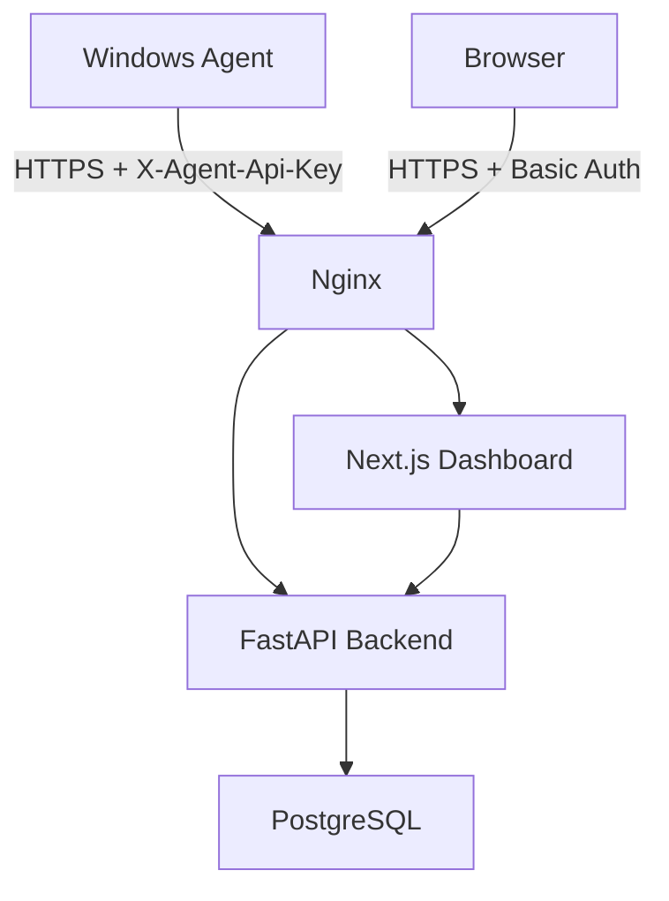

# IT Center Security Cloud

> Plataforma full stack para monitoramento, inventário, observabilidade e segurança de máquinas Windows, com agente PowerShell, API FastAPI, PostgreSQL, dashboard web e práticas iniciais de SOC/Blue Team.

Status: Fases 0 a 9 concluídas (governança/autenticação e operação/segurança de produção validadas em produção real) | Fase 12 (Terraform/IaC) em andamento (import ainda não executado) | Fase 13 (hardening do agente Windows) concluída, exceto assinatura de código, pendente de certificado | Fase 14 (hardening do dashboard) e Fase 15 (orquestração de agentes de IA, ADR-026) concluídas | Fases 16 a 18 (RustDesk/Snipe-IT, relatórios/dashboard executivo, observabilidade de infraestrutura) com planejamento e ADRs concluídos, implementação pendente — ver Roadmap | Ambiente local Docker operacional | Produção publicada na Oracle Cloud | Agente Windows integrado ao check-in.

---

## Índice

* Sobre o Projeto
* Objetivo
* Arquitetura
* Fluxo do Sistema
* Funcionalidades Planejadas
* Stack
* Estrutura do Projeto
* Segurança
* SOC Light
* Deploy
* Como Executar
* Documentação
* Roadmap
* Autor

---

## Sobre o Projeto

O IT Center Security Cloud é uma plataforma criada para monitorar computadores e servidores Windows por meio de agentes leves.

A proposta é centralizar informações de inventário, desempenho e segurança em um dashboard web, permitindo maior visibilidade sobre ativos corporativos.

O projeto nasceu com foco em:

* Infraestrutura de TI
* Monitoramento
* Inventário
* Observabilidade
* Segurança defensiva
* SOC Light
* DevOps
* Cloud gratuita

---

## Objetivo

Criar uma solução simples, gratuita e escalável para:

* Cadastrar máquinas automaticamente.
* Coletar métricas de CPU, RAM e disco.
* Registrar inventário básico.
* Monitorar status online/offline.
* Detectar eventos de segurança.
* Gerar alertas iniciais de SOC.
* Hospedar tudo em ambiente gratuito.

---

## Arquitetura

```text
Internet
      ↓
Oracle Cloud VCN (10.0.0.0/16)
      ↓
Subnet pública (10.0.0.0/24)
      ↓
itcenter-edge-01 (Ubuntu Server 24.04)
      ↓
Nginx → Next.js → FastAPI → PostgreSQL
```

| Camada          | Responsabilidade                                          |
| --------------- | --------------------------------------------------------- |
| Agente Windows  | Coleta inventário, métricas e eventos de segurança        |
| Backend FastAPI | Recebe check-ins, processa dados e expõe endpoints        |
| PostgreSQL      | Armazena máquinas, métricas, programas, eventos e alertas |
| Dashboard Web   | Exibe máquinas, métricas, inventário e alertas            |
| Nginx           | Proxy reverso, HTTPS e exposição segura                   |
| Docker Compose  | Orquestra os containers do MVP                            |

No MVP, todos os containers de produção executam no nó de borda `itcenter-edge-01`. Somente o Nginx recebe tráfego público nas portas 80 e 443; frontend, backend e banco permanecem na rede interna do Docker. A subnet privada `10.0.1.0/24` fica reservada para a futura separação dos serviços, sem alterar a entrada pública do sistema.

---

## Fluxo do Sistema

```text
1. O agente PowerShell roda na máquina Windows.
2. Ele coleta hostname, usuário, IP, CPU, RAM, disco e dados de segurança.
3. Os dados são enviados para a API.
4. A API salva as informações no PostgreSQL.
5. O dashboard consulta a API.
6. O usuário visualiza máquinas, métricas e alertas.
```

---

## Funcionalidades Planejadas

### Inventário

* Hostname
* Usuário logado
* IP
* Sistema operacional
* Versão do Windows
* Programas instalados

### Monitoramento

* CPU
* RAM
* Disco
* Uptime
* Último check-in
* Status online/offline

### Segurança

* Firewall
* Windows Defender
* RDP
* Usuários administradores locais
* Dispositivos USB
* Ferramentas de acesso remoto

### SOC Light

* Falhas de login
* Novo administrador local
* Firewall desativado
* Defender desativado
* RDP habilitado sem autorização
* Software remoto não autorizado
* Torrent detectado
* Máquina desconhecida

---

## Stack

| Camada           | Tecnologia             |
| ---------------- | ---------------------- |
| Backend          | Python, FastAPI        |
| Banco de Dados   | PostgreSQL             |
| Frontend         | Next.js, TypeScript    |
| Agente           | PowerShell             |
| Infraestrutura   | Docker, Docker Compose |
| IaC              | Terraform (VCN, subnets, security list e instância — ADR-024) |
| Proxy            | Nginx                  |
| Hospedagem       | Oracle Cloud Free Tier |
| Segurança futura | Wazuh, OpenVAS         |

---

## Estrutura do Projeto

```text
it-center-security-cloud/
|-- README.md
|-- PROJECT_PLAN.md
|-- .claude/
|   |-- agents/
|   `-- commands/
|-- backend/
|   `-- app/
|-- frontend/
|   `-- dashboard/
|-- agent-windows/
|-- infra/
|   |-- docker-compose.yml
|   |-- docker-compose.production.yml
|   |-- nginx/
|   |-- scripts/
|   `-- terraform/
`-- docs/
    |-- README.md
    |-- architecture/
    |-- deployment/
    |-- security/
    |-- backend/
    |-- agent/
    |-- development/
    `-- assets/
```

---

## Segurança

O projeto aplica os seguintes controles de segurança:

* Não coletar senhas.
* Não coletar histórico de navegação.
* Não coletar conteúdo de arquivos pessoais.
* Não armazenar secrets no GitHub.
* Utilizar `.env` e `.env.production` para variáveis sensíveis, sem versionar segredos.
* Exigir `X-Agent-Api-Key` no check-in do agente.
* Validar payloads recebidos dos agentes.
* Utilizar HTTPS obrigatório em produção.
* Manter PostgreSQL, FastAPI e Next.js sem portas públicas em produção.
* Proteger o dashboard e a proxy administrativa com HTTP Basic no Nginx.
* Executar o preflight de produção e a verificação de CVEs antes da publicação.

Os detalhes e as limitações conhecidas estão em `docs/security/SECURITY.md` e `docs/deployment/PRODUCTION.md`.

---

## SOC Light

O projeto terá uma camada inicial de práticas SOC/Blue Team.

As regras serão baseadas em contexto e política de ativos.

Exemplo:

```text
RustDesk instalado em máquina autorizada:
    registrar evento

RustDesk instalado em máquina não autorizada:
    gerar alerta

Torrent detectado:
    gerar alerta imediato
```

A fonte de verdade para softwares autorizados será:

```text
docs/security/ASSET_POLICY.md
```

As regras de detecção estarão em:

```text
docs/security/SOC_RULES.md
```

---

## Deploy

O deploy em produção está publicado na Oracle Cloud e foi validado pelo workflow manual `Deploy Production` do GitHub Actions.

Ambiente atual:

```text
Oracle Cloud Free Tier
VCN: 10.0.0.0/16
Subnet pública: 10.0.0.0/24
Subnet privada reservada: 10.0.1.0/24
itcenter-edge-01: Ubuntu Server 24.04
Docker
Docker Compose
Nginx
PostgreSQL
FastAPI
Next.js
```

Objetivo:

Manter o MVP com custo zero.

O ambiente local usa `infra/docker-compose.yml`. Para produção, a proposta de bootstrap versionado do Edge Node está documentada em `docs/deployment/BOOTSTRAP.md`. A publicação usa `infra/scripts/deploy.sh` e `infra/docker-compose.production.yml`, que publica apenas o Nginx nas portas 80 e 443; os demais serviços permanecem na rede interna do Docker. O procedimento completo, incluindo DNS, certificado TLS, credencial administrativa, preflight, backup, rollback e renovação de certificado, está em `docs/deployment/PRODUCTION.md`.

Comando principal de produção na VM:

```bash
cd /opt/itcenter/app/it-center-security-cloud
sh infra/scripts/deploy.sh
```

### Produção atual

```text
Domínio: itcenter-daniel.chickenkiller.com
IP publico: 147.15.78.220
VM: Oracle Cloud Ubuntu 24.04 LTS
Rede Docker: itcenter-network
Entrada publica: Nginx 80/443
```

Fluxo de comunicação:



Somente o Nginx expõe portas públicas. PostgreSQL, FastAPI e Next.js permanecem internos na rede Docker.

### Guias de produção

| Guia | Finalidade |
| --- | --- |
| `docs/deployment/ORACLE_CLOUD.md` | Implantacao completa na Oracle Cloud. |
| `docs/deployment/SETUP.md` | Preparação do ambiente de produção. |
| `docs/deployment/HTTPS.md` | DNS, Certbot, TLS e renovacao. |
| `docs/deployment/DEPLOYMENT_HISTORY.md` | Historico real da implantacao feita. |
| `docs/deployment/TROUBLESHOOTING.md` | Diagnostico operacional. |
| `docs/deployment/KNOWN_ISSUES.md` | Limitacoes e problemas conhecidos. |
| `docs/deployment/LESSONS_LEARNED.md` | Aprendizados da implantacao. |
| `docs/architecture/INFRASTRUCTURE.md` | Arquitetura de infraestrutura. |
| `docs/architecture/NETWORK.md` | Rede, DNS e portas. |
| `docs/architecture/CONTAINERS.md` | Containers e responsabilidades. |
| `docs/architecture/SECURITY.md` | Controles de seguranca. |

### Validar ambiente

Na VM:

```bash
cd /opt/itcenter/app/it-center-security-cloud
sh infra/scripts/preflight-production.sh
docker ps
docker compose --env-file .env.production -f infra/docker-compose.production.yml ps
```

Testes principais:

```bash
curl -I https://itcenter-daniel.chickenkiller.com
curl --user admin:SENHA_FORTE_AQUI https://itcenter-daniel.chickenkiller.com
```

### Backup

```bash
cd /opt/itcenter/app/it-center-security-cloud
sh infra/scripts/backup.sh
```

Destino:

```text
/opt/itcenter/backups
```

### HTTPS e domínio

O domínio atual é:

```text
itcenter-daniel.chickenkiller.com
```

Certificados esperados:

```text
/etc/letsencrypt/live/itcenter-daniel.chickenkiller.com/fullchain.pem
/etc/letsencrypt/live/itcenter-daniel.chickenkiller.com/privkey.pem
```

Se um provedor local não resolver o domínio, valide com resolvers públicos:

```bash
dig @8.8.8.8 itcenter-daniel.chickenkiller.com
dig @1.1.1.1 itcenter-daniel.chickenkiller.com
dig @9.9.9.9 itcenter-daniel.chickenkiller.com
```

### Agente Windows

O agente Windows já está integrado ao ambiente publicado. O check-in de produção usa `POST /api/v1/agent/checkin` via HTTPS e autentica com o header `X-Agent-Api-Key`, que deve ser igual ao `AGENT_API_KEY` definido na VM.

Estado atual do agente:

* Instalação controlada por script PowerShell, com ACL restrita em `config.json` (EPIC 16).
* Execução periódica por Tarefa Agendada do Windows.
* Cache offline e reenvio de check-ins pendentes, com quarentena de arquivo corrompido e retenção por idade (EPIC 16).
* Retry inteligente para timeout, falha de rede, HTTP 408, HTTP 429 e respostas 5xx.
* Troubleshooting operacional documentado em `docs/agent/TROUBLESHOOTING.md`.

Próximas evoluções do agente:

* Assinatura de código (code-signing) — pendente de certificado.
* Separar o agente como produto independente.
* Adicionar atualização automática.
* Avaliar serviço Windows nativo.
* Adicionar compressão, criptografia e assinatura de payloads.

### Troubleshooting rapido

```bash
docker logs itcenter-nginx
docker logs itcenter-frontend
docker logs itcenter-backend
docker logs itcenter-postgres
```

Guias detalhados:

```text
docs/deployment/TROUBLESHOOTING.md
docs/deployment/KNOWN_ISSUES.md
docs/deployment/LESSONS_LEARNED.md
```

---

## Como Executar

Fluxo local recomendado:

```bash
git clone <repo-url>
cd it-center-security-cloud
cp .env.example .env
docker compose -f infra/docker-compose.yml up --build
```

No Windows, se o terminal não estiver na raiz do projeto, entre nela antes:

```powershell
cd "<caminho-local>\it-center-security-cloud"
docker compose -f infra/docker-compose.yml up --build
```

Em segundo plano:

```bash
docker compose -f infra/docker-compose.yml up --build -d
```

Serviços iniciados:

```text
postgres
backend
frontend
```

URLs locais:

```text
Dashboard: http://127.0.0.1:3000
Backend:   http://127.0.0.1:8000/api/v1/health
Postgres:  127.0.0.1:5432
```

Parar:

```bash
docker compose -f infra/docker-compose.yml down
```

Parar e apagar dados locais do banco:

```bash
docker compose -f infra/docker-compose.yml down -v
```

---

## Documentação

| Arquivo              | Função                                     |
| -------------------- | ------------------------------------------ |
| PROJECT_PLAN.md      | Visão estratégica do projeto               |
| docs/README.md       | Índice global da documentação              |
| docs/architecture/   | Arquitetura e fluxo de dados               |
| docs/deployment/     | Setup, produção e troubleshooting          |
| docs/security/       | Segurança, autenticação e regras SOC       |
| docs/backend/        | API e banco de dados                       |
| docs/agent/          | Agente Windows e check-in                  |
| docs/development/    | Contribuição, roadmap, decisões e tarefas  |
| docs/assets/         | Diagramas e imagens                        |

---

## Roadmap

### Fase 0 - Planejamento — concluída

* Documentação base
* Arquitetura
* Banco
* API
* Agente
* Segurança
* Regras SOC

### Fase 1 - Backend MVP — concluída

* FastAPI
* Health check
* Endpoint de check-in
* PostgreSQL

### Fase 2 - Agente Windows — concluída

* Coleta de inventário
* Coleta de métricas
* Envio para API

### Fase 3 - Dashboard — concluída

* Máquinas online/offline
* Último check-in
* CPU/RAM/Disco

### Fase 4 - SOC Light — concluída

* Eventos de segurança
* Alertas básicos
* Políticas de ativos

### Fase 5 - Deploy Cloud — concluída

* Oracle Cloud
* Bootstrap versionado do Edge Node
* Docker Compose
* Nginx
* HTTPS

### Fase 6 - Agente Windows em Produção — concluída

* Instalação controlada
* Tarefa Agendada do Windows
* Configuração de produção
* Logs e cache padronizados
* Check-in real em produção

### Fase 7 - Validação Fim a Fim e Dashboard Operacional — concluída

* Fluxo Windows Agent -> Nginx -> FastAPI -> PostgreSQL -> Dashboard
* Detalhes da máquina
* Histórico de métricas
* Eventos por máquina
* Filtros operacionais

### Fase 8 - Governança — concluída

* Login
* Perfis e controle de acesso
* Auditoria

### Fase 9 - Operação e Segurança de Produção — concluída

* Backup automático
* Restore testado em produção
* Rollback validado em produção (com rollforward)
* Renovação de certificado TLS validada em produção
* Monitoramento básico da VM
* Gate de imagens Docker

### Fase 10 - SOC Avançado

* Wazuh
* OpenVAS

### Fase 11 - SaaS

* Multiempresa
* Multiusuário
* SaaS

### Fase 12 - Infraestrutura como Código — em andamento

* Módulos Terraform (network e compute)
* Import dos recursos Oracle Cloud já existentes, sem destroy/recreate
* `terraform plan` zero-diff validado
* Backend de state remoto em OCI Object Storage

### Fase 13 - Hardening do Agente Windows — concluída, exceto assinatura de código

* ACL restrita em `config.json` (protege `agent_api_key`)
* Quarentena de cache corrompido e retenção por idade
* Rotação de logs por tamanho
* Medição de CPU mais precisa (Get-Counter, com fallback)
* Inventário cobrindo apps UWP/Store
* Detecção de USB além de armazenamento
* Scripts assinados (code-signing) — pendente, depende de certificado

### Fase 14 - Hardening do Dashboard (Frontend) — concluída

* Token de autenticação migrado de `localStorage` para cookie `httpOnly` + `Secure` + `SameSite=Strict`
* `Content-Security-Policy` no Next.js e `middleware.ts` com gate de sessão no edge
* Allowlist de rotas e remoção do fallback `NEXT_PUBLIC_API_BASE_URL` no proxy interno
* `npm audit` restabelecido via CI

### Fase 15 - Orquestração de Agentes de IA — concluída

* Subagents e slash commands nativos do Claude Code (`.claude/agents/`, `.claude/commands/`)
* Pipeline `/feature` via Workflow tool
* Sem Strix/OpenAI/Gemini nem framework próprio (ADR-026, `docs/development/AI_WORKFLOW.md`)

### Fase 16 - Hub de Integração: RustDesk e Snipe-IT — planejamento concluído (ADR-027, ADR-028), implementação pendente

* Acesso remoto integrado via RustDesk e inventário administrativo via Snipe-IT, sem reimplementar nenhuma das duas especialidades

### Fase 17 - Relatórios PDF e Dashboard Executivo — planejamento concluído (ADR-029), implementação pendente

* Exportação de relatórios em PDF (`reportlab`) e visão executiva resumida do dashboard

### Fase 18 - Observabilidade de Infraestrutura — planejamento concluído (ADR-030), implementação pendente

* Prometheus + Grafana para o Edge Node/containers — não substitui as métricas por máquina que o agente já coleta

---

## Autor

Desenvolvido por Daniel da Silva Azevedo como projeto de portfólio e aprendizado prático em Infraestrutura, DevOps, Cloud, Observabilidade e Cyber Security.
