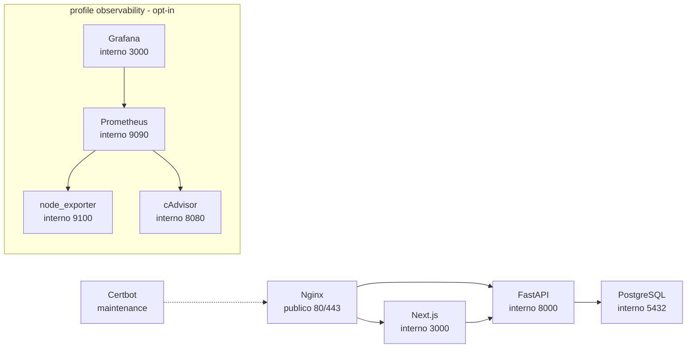

# Containers Architecture

Este documento descreve os containers de producao.

## Servicos

```text
postgres
backend
frontend
nginx
certbot
node_exporter   (profile: observability)
cadvisor        (profile: observability)
prometheus      (profile: observability)
grafana         (profile: observability)
```

## Diagrama



## PostgreSQL

Responsabilidade:

* Persistir maquinas.
* Persistir metricas.
* Persistir eventos.
* Persistir alertas.

Persistencia:

```text
postgres_data
```

## Backend

Responsabilidade:

* Expor API FastAPI.
* Receber check-ins do agente.
* Aplicar migrations no startup.
* Persistir dados no PostgreSQL.

Healthcheck:

```text
/api/v1/health
```

## Frontend

Responsabilidade:

* Servir dashboard Next.js.
* Consumir backend via proxy interno.

Observacao:

* Dashboard pode ficar vazio ate o Windows Agent enviar dados.

## Nginx

Responsabilidade:

* TLS.
* Redirect HTTP para HTTPS.
* Basic Auth no dashboard.
* Endpoint do agente sem Basic Auth.
* Reverse proxy.
* Headers de seguranca.
* Rate limit.

## Certbot

Responsabilidade:

* Emitir e renovar certificados Let's Encrypt.

Modo:

```text
maintenance profile
```

## Observabilidade de infraestrutura (EPIC 21, ADR-030)

Responsabilidade: saude do Edge Node e dos containers Docker — nao das maquinas Windows monitoradas pelo agente (essas ja tem `metrics`, EPIC 3).

* **node_exporter** (`prom/node-exporter:v1.8.2`): metricas de CPU/RAM/disco/rede da VM, lendo `/proc`, `/sys` e `/` montados somente leitura. `mem_limit: 30m`.
* **cadvisor** (`gcr.io/cadvisor/cadvisor:v0.49.1`): metricas de CPU/memoria por container. Roda sem `privileged: true` e sem montar `/var/run` (docker.sock) de proposito (menor privilegio, ver `docs/security/SECURITY.md`) — um mount `:ro` do socket ainda permitiria chamadas completas a API do Docker, virando root no host em caso de RCE. Isso reduz metricas de I/O em disco e enriquecimento de nome/labels (mostra ID/cgroup em vez do nome amigavel), mas mantem CPU/memoria por container, suficiente para o objetivo desta EPIC. `mem_limit: 100m`.
* **prometheus** (`prom/prometheus:v2.55.1`): scrape de `node_exporter:9100` e `cadvisor:8080` a cada 30s; retencao curta (`5d` / `200MB`) por causa do disco limitado da VM. `mem_limit: 200m`.
* **grafana** (`grafana/grafana-oss:11.1.0`): datasource Prometheus e dashboard "Edge Node Overview" provisionados automaticamente no startup (`infra/observability/grafana/`). `mem_limit: 150m`.

Modo:

```text
profiles: ["observability"]
```

Nao sobem com `docker compose up` padrao — precisam de `--profile observability` explicito, ativado manualmente pelo operador apos validar RAM/disco disponiveis (`infra/scripts/ops-check.sh`). Nenhum dos quatro publica porta no host; acesso e via `docker exec` ou tunel SSH direto ao IP do container na rede `itcenter-network` (ver `docs/architecture/NETWORK.md` e `docs/security/SECURITY.md`).

## Estado esperado

```text
itcenter-postgres  healthy
itcenter-backend   healthy
itcenter-frontend  healthy
itcenter-nginx     healthy
```

Com o profile `observability` ativo, adicionalmente:

```text
itcenter-node-exporter  running
itcenter-cadvisor       running
itcenter-prometheus     running
itcenter-grafana        running
```
