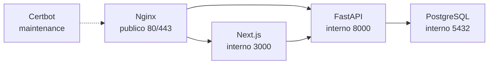

# Containers Architecture

Este documento descreve os containers de producao.

## Servicos

```text
postgres
backend
frontend
nginx
certbot
```

## Diagrama



## PostgreSQL

Responsabilidade:

* Persistir maquinas.
* Persistir metricas.
* Persistir eventos.
* Persistir alertas.

Persistencia:

```text
postgres_data
```

## Backend

Responsabilidade:

* Expor API FastAPI.
* Receber check-ins do agente.
* Aplicar migrations no startup.
* Persistir dados no PostgreSQL.

Healthcheck:

```text
/api/v1/health
```

## Frontend

Responsabilidade:

* Servir dashboard Next.js.
* Consumir backend via proxy interno.

Observacao:

* Dashboard pode ficar vazio ate o Windows Agent enviar dados.

## Nginx

Responsabilidade:

* TLS.
* Redirect HTTP para HTTPS.
* Basic Auth no dashboard.
* Endpoint do agente sem Basic Auth.
* Reverse proxy.
* Headers de seguranca.
* Rate limit.

## Certbot

Responsabilidade:

* Emitir e renovar certificados Let's Encrypt.

Modo:

```text
maintenance profile
```

## Estado esperado

```text
itcenter-postgres  healthy
itcenter-backend   healthy
itcenter-frontend  healthy
itcenter-nginx     healthy
```
