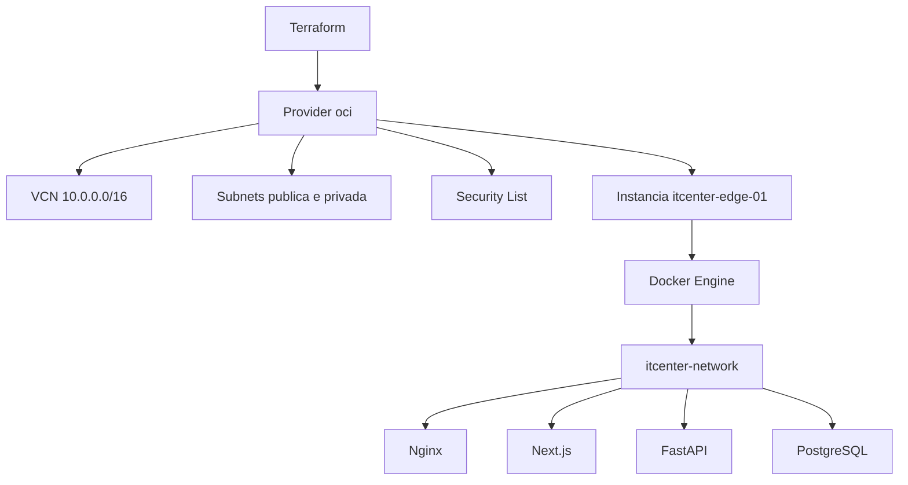

# Infrastructure as Code (Terraform)

Este documento descreve como a camada de infraestrutura Oracle Cloud do IT Center Security Cloud passa a ser provisionada e versionada via Terraform, a partir do ADR-024.

## Visao geral



O Terraform provisiona somente o que existe **abaixo do sistema operacional e da rede**. Docker Compose, Nginx, backend, frontend, PostgreSQL e os scripts de `infra/scripts/` continuam exatamente como estao hoje e nao sao geridos pelo Terraform.

## Escopo

Provisionado por Terraform:

```text
VCN
Subnet publica
Subnet privada
Internet Gateway
Route Table
Security List
Instancia de computacao (itcenter-edge-01)
```

Fora do escopo do Terraform:

```text
Docker Compose (infra/docker-compose.production.yml)
Scripts de deploy, backup, restore, rollback (infra/scripts/)
Certificados TLS (Certbot)
Migrations e dados do PostgreSQL
NAT Gateway e Service Gateway (existem, ver secao "Descoberta real" abaixo)
```

## Mapeamento com as camadas da arquitetura

A divisao de camadas ja definida em `docs/architecture/INFRASTRUCTURE.md` continua valendo. O Terraform e responsavel apenas pela primeira:

```text
Infrastructure Layer  -> Terraform (VCN, subnets, security list, instancia, volume de boot)
Platform Layer        -> Docker Compose (Nginx, Certbot)
Application Layer     -> Docker Compose (Next.js, FastAPI)
Data Layer            -> Docker Compose (PostgreSQL)
Security Layer        -> Transversal (HTTPS, Basic Auth, RBAC, secrets fora do Git)
```

## Modulos

```text
infra/terraform/
├── modules/
│   ├── network/   VCN, subnets, internet gateway, route table, security list
│   └── compute/   instancia do Edge Node
└── environments/
    └── production/   referencia os modulos com os valores reais
```

Dois modulos pequenos, nao um por recurso individual: o ciclo de vida de rede e o ciclo de vida da instancia sao diferentes (trocar shape ou imagem da VM nunca deve arriscar tocar a VCN).

## Descoberta real (import executado em 2026-08-04)

A descoberta via `oci` CLI revelou uma topologia mais rica do que a descrita acima: a VCN foi originalmente criada pelo "VCN Wizard" da Oracle, que provisiona automaticamente um NAT Gateway e um Service Gateway junto com a subnet privada, alem de dar a cada subnet sua propria route table e security list dedicadas (a subnet publica usa a route table/security list *default* da VCN; a subnet privada usa uma route table/security list separadas, com rota para o NAT Gateway). Isso significa que:

```text
Subnet privada -> nao esta "sem uso": ja tem saida de internet via NAT Gateway
Route table    -> existem 2 (default, da subnet publica; dedicada, da subnet privada)
Security list  -> existem 2 (default, da subnet publica; dedicada, da subnet privada)
```

Decisao tomada: NAT Gateway e Service Gateway permanecem fora do escopo do Terraform (nao ha necessidade de geri-los - nada os toca, `block_traffic = false` desde a criacao). A route table e a security list da subnet privada tambem nao sao modeladas como recursos Terraform proprios - a subnet privada as referencia por OCID via variavel (`private_route_table_id`, `private_security_list_ids`), sem tentar gerir o NAT Gateway/Service Gateway que elas apontam. Route table e security list da subnet *publica* continuam totalmente geridas pelo Terraform (`oci_core_route_table.public`, `oci_core_security_list.public`), pois governam o trafego de entrada real do Edge Node.

O IP publico `147.15.78.220` foi confirmado como `EPHEMERAL` (nao `RESERVED`). Decisao: manter efemero por enquanto (nenhum `apply` de recriacao roda durante a introducao do Terraform, entao o risco abaixo nao se materializa hoje). Reservar no futuro exige criar um IP novo (a OCI nao converte um efemero em reservado no mesmo endereco) e migrar o DNS numa janela planejada.

## Introducao via import, nunca destroy/recreate

A VM `itcenter-edge-01` ja roda em producao com dados reais. A introducao do Terraform segue estritamente por `terraform import`, na ordem:

```text
1. VCN
2. Internet Gateway
3. Route Table
4. Security List
5. Subnet publica
6. Subnet privada
7. Instancia de computacao
8. IP publico (se reservado)
```

Regra: apos importar cada recurso, `terraform plan` precisa mostrar zero diferenca para aquele recurso antes de importar o proximo. So depois de todos os recursos importados o `terraform plan` completo precisa retornar `No changes.`. Nenhum `apply` de criacao e executado nesta introducao.

`lifecycle { prevent_destroy = true }` e aplicado na VCN e na instancia como trava adicional.

## Bootstrap e cloud-init

`docs/deployment/BOOTSTRAP.md` continua a fonte de verdade da preparacao do host (`01-system.sh` a `05-firewall.sh` e `bootstrap.sh`). O `user_data` da instancia **ja viva** nao e alterado durante a introducao do Terraform, pois isso quebraria o `plan` zero-diff e cloud-init nao reexecuta em instancia ja iniciada.

O modulo `compute` expoe uma variavel opcional para ativar o bootstrap via `user_data`, desligada por padrao, reservada para uma futura VM nova ou cenario de recuperacao de desastre.

## State

```text
Fase inicial: local (reduz variaveis durante o import)
Fase alvo:    remoto, backend S3-compativel apontando para OCI Object Storage
```

O bucket de Object Storage e criado manualmente uma unica vez (Terraform nao pode gerenciar o bucket que guarda o proprio state). Versionamento do bucket habilitado como rede de seguranca adicional para o state.

## Secrets

```text
Usuario IAM dedicado: terraform-provisioner
Escopo: minimo, restrito ao compartment do Edge Node
Chave de API: fora da arvore do repositorio (nunca em infra/terraform/, mesmo gitignored)
```

## Riscos

```text
Recurso esquecido no import          -> Terraform tenta recriar/duplicar
State local corrompido por sync      -> pasta do projeto esta sob OneDrive
IP publico efemero (nao reservado)   -> confirmado EPHEMERAL em producao (2026-08-04); replace acidental da instancia trocaria o IP e quebraria o DNS - mitigado por nunca rodar apply de recriacao
Shape Always Free indisponivel       -> risco ao recriar a instancia numa recuperacao futura
Drift de versao do provider oci      -> comitar .terraform.lock.hcl
```

Detalhes operacionais (comandos, runbook de import) ficam em `infra/terraform/README.md`. Decisao registrada em ADR-024 (`docs/development/DECISIONS.md`).
