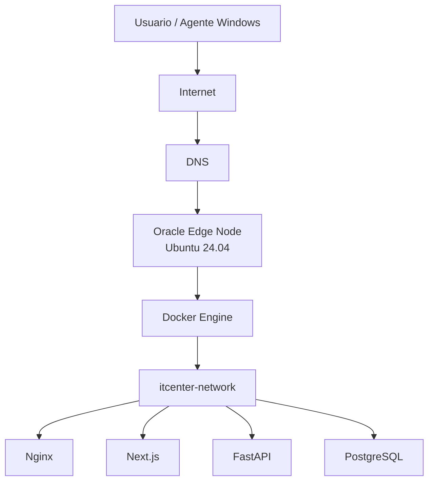

# Infrastructure Architecture

Este documento descreve a camada de infraestrutura do IT Center Security Cloud em producao.

## Visao geral



## Edge Node

O Edge Node atual e:

```text
itcenter-edge-01
```

Responsabilidades:

* Hospedar Docker Engine.
* Executar Docker Compose.
* Publicar Nginx nas portas 80 e 443.
* Manter backend, frontend e banco apenas na rede interna.
* Guardar arquivos operacionais em `/opt/itcenter`.

## Camadas

```text
Infrastructure Layer
Platform Layer
Application Layer
Data Layer
Security Layer
```

### Infrastructure Layer

Componentes:

* Oracle Cloud VM.
* Ubuntu Server 24.04 LTS.
* Docker Engine.
* Docker Compose.
* Rede `itcenter-network`.
* Volume `postgres_data`.

### Platform Layer

Componentes:

* Nginx.
* Certbot.
* TLS Let's Encrypt.
* Scripts de deploy e preflight.

### Application Layer

Componentes:

* Next.js Dashboard.
* FastAPI Backend.
* Windows Agent.

### Data Layer

Componentes:

* PostgreSQL.
* Migrations.
* Backups.

### Security Layer

Controles:

* HTTPS.
* HSTS.
* Basic Auth.
* API Key do agente.
* Rede Docker interna.
* Secrets fora do Git.
* Nginx como unico ponto publico.

## Principio de exposicao minima

Somente o Nginx expoe portas no host:

```text
80/tcp
443/tcp
```

Nao expor publicamente:

```text
3000/tcp
8000/tcp
5432/tcp
```

## Provisionamento

A partir do ADR-024, a Infrastructure Layer descrita neste documento passa a ser provisionada e versionada via Terraform. Ver `docs/architecture/IAC.md`.
