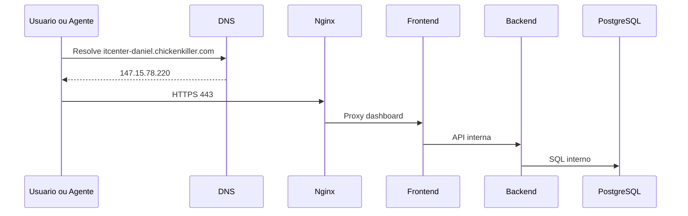

# Network Architecture

Este documento descreve a rede de producao.

## Fluxo externo



## DNS

```text
Dominio: itcenter-daniel.chickenkiller.com
IP: 147.15.78.220
```

## Rede Docker

Nome:

```text
itcenter-network
```

Objetivo:

* Permitir comunicacao interna por DNS Docker.
* Isolar PostgreSQL, backend e frontend da internet.
* Facilitar troubleshooting e futuras evolucoes.

## Publicacao de portas

| Servico | Porta interna | Porta publica | Exposto? |
| --- | ---: | ---: | --- |
| Nginx | 80/443 | 80/443 | Sim |
| Frontend | 3000 | N/A | Nao |
| Backend | 8000 | N/A | Nao |
| PostgreSQL | 5432 | N/A | Nao |

## Security Lists / Firewall

Permitir:

```text
22/tcp  - SSH administrativo
80/tcp  - HTTP challenge e redirect
443/tcp - HTTPS
```

Bloquear externamente:

```text
3000/tcp
8000/tcp
5432/tcp
```

## Observacao sobre DNS

Durante a implantacao foi observado atraso de propagacao no DNS da Vivo. Outros resolvers, como Google DNS, Cloudflare e Quad9, resolviam corretamente.

Conclusao:

```text
Nao era falha da aplicacao, Nginx ou Oracle Cloud.
```
