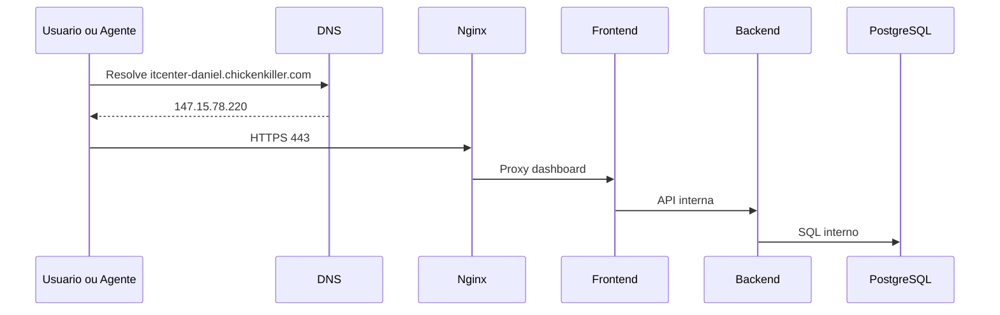

# Network Architecture

Este documento descreve a rede de producao.

## Fluxo externo



## DNS

```text
Dominio: itcenter-daniel.chickenkiller.com
IP: 147.15.78.220 (efemero - ver nota abaixo)
```

O IP publico e efemero (`lifetime: EPHEMERAL`, escopo `AVAILABILITY_DOMAIN`), confirmado via `oci network public-ip get` durante o import do Terraform (EPIC 15, 2026-08-04). A OCI nao permite converter um IP efemero em reservado no mesmo endereco - so criando um novo IP reservado (endereco diferente). Decisao atual: manter efemero, risco documentado em `docs/architecture/IAC.md`. Reservar exigiria uma janela de manutencao planejada com atualizacao do registro DNS.

## VCN e subnets

A VCN `itcenter-vcn` (`10.0.0.0/16`) foi criada via "VCN Wizard" da Oracle, que provisiona automaticamente mais recursos do que a subnet publica/privada citadas na documentacao original:

```text
Subnet publica  (10.0.0.0/24) -> route table default -> Internet Gateway
Subnet privada  (10.0.1.0/24) -> route table dedicada -> NAT Gateway + Service Gateway
```

A subnet privada nao esta "sem uso": ja tem saida de internet configurada via NAT Gateway (para atualizacoes de pacotes, por exemplo) e acesso ao Oracle Services Network via Service Gateway, mesmo sem nenhum recurso rodando nela hoje. NAT Gateway e Service Gateway ficam fora do escopo do Terraform (ADR-024) - sao apenas referenciados pelo OCID ja existente em `infra/terraform/modules/network`, nunca criados/destruidos por ele. Detalhes do import em `docs/architecture/IAC.md`.

## Rede Docker

Nome:

```text
itcenter-network
```

Objetivo:

* Permitir comunicacao interna por DNS Docker.
* Isolar PostgreSQL, backend e frontend da internet.
* Facilitar troubleshooting e futuras evolucoes.

## Publicacao de portas

| Servico | Porta interna | Porta publica | Exposto? |
| --- | ---: | ---: | --- |
| Nginx | 80/443 | 80/443 | Sim |
| Frontend | 3000 | N/A | Nao |
| Backend | 8000 | N/A | Nao |
| PostgreSQL | 5432 | N/A | Nao |
| node_exporter (profile `observability`) | 9100 | N/A | Nao |
| cAdvisor (profile `observability`) | 8080 | N/A | Nao |
| Prometheus (profile `observability`) | 9090 | N/A | Nao |
| Grafana (profile `observability`) | 3000 | N/A | Nao |

## Acesso a Prometheus/Grafana (EPIC 21, ADR-030)

Os 4 servicos de observabilidade (`node_exporter`, `cadvisor`, `prometheus`, `grafana`) nunca publicam porta no host — nenhum `-p`/`ports:` no Compose e nenhuma `location` nova no `nginx.conf.template`. Acesso operacional exclusivamente por:

```bash
# 1. Descobrir o IP do container na rede itcenter-network
docker inspect itcenter-grafana --format '{{(index .NetworkSettings.Networks "itcenter-network").IPAddress}}'

# 2. Tunel SSH direto para esse IP:porta, sem publicar nada no host
ssh -L 3001:<IP_DO_CONTAINER>:3000 <usuario>@itcenter-edge-01

# 3. Acessar localmente
# http://127.0.0.1:3001
```

O mesmo padrao vale para Prometheus (porta 9090). `docker exec -it itcenter-prometheus sh` ou `docker exec -it itcenter-grafana sh` tambem servem para checagens rapidas sem precisar do tunel. Essa restricao e deliberada: a VM Oracle Free Tier tem 1GB de RAM e o Nginx deve continuar sendo o unico ponto de entrada publico do Edge Node.

## Security Lists / Firewall

Permitir:

```text
22/tcp  - SSH administrativo
80/tcp  - HTTP challenge e redirect
443/tcp - HTTPS
```

Bloquear externamente:

```text
3000/tcp
8000/tcp
5432/tcp
```

## Provisionamento

A VCN, as subnets e a Security List descritas neste documento passam a ser provisionadas e versionadas via Terraform a partir do ADR-024. Ver `docs/architecture/IAC.md`.

## Observacao sobre DNS

Durante a implantacao foi observado atraso de propagacao no DNS da Vivo. Outros resolvers, como Google DNS, Cloudflare e Quad9, resolviam corretamente.

Conclusao:

```text
Nao era falha da aplicacao, Nginx ou Oracle Cloud.
```
