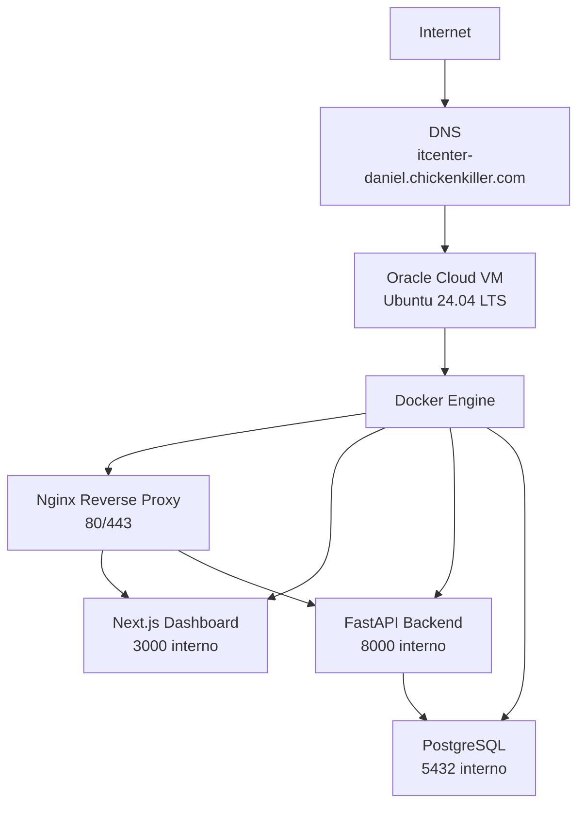

# Oracle Cloud Deployment

Este documento descreve a implantacao do IT Center Security Cloud em uma VM da Oracle Cloud usando Ubuntu 24.04 LTS, Docker, Docker Compose, Nginx e Let's Encrypt.

## Ambiente implantado

```text
Cloud provider: Oracle Cloud
Sistema: Ubuntu Server 24.04 LTS
Dominio: itcenter-daniel.chickenkiller.com
IP publico: 147.15.78.220
Runtime: Docker Engine + Docker Compose
Rede Docker: itcenter-network
Diretorio da aplicacao: /opt/itcenter/app/it-center-security-cloud
Backups: /opt/itcenter/backups
```

## Arquitetura de producao



## Etapas realizadas

A cronologia detalhada do deploy inicial (2026-06-26) fica em `docs/deployment/DEPLOYMENT_HISTORY.md` ("Linha do tempo tecnica"), fonte de verdade dessa narrativa — nao duplicada aqui.

## Checklist Oracle Cloud

Nota: a VCN, as subnets, a security list e a instância `itcenter-edge-01` já são geridas via Terraform (`infra/terraform/README.md`, `docs/architecture/IAC.md`, ADR-024) — os itens de rede/instância abaixo não são mais um passo avulso de Console, e sim resultado de `terraform import`/`apply` já executado e auditável em código. O IP público (`147.15.78.220`) é **efêmero** (não reservado), decisão consciente de não travar a associação a um IP fixo neste estágio do MVP.

- [ ] VM Ubuntu 24.04 LTS criada.
- [ ] IP publico associado.
- [ ] Porta 22 liberada apenas para origem administrativa.
- [ ] Porta 80 liberada para emissao/renovacao TLS.
- [ ] Porta 443 liberada para HTTPS.
- [ ] Portas 3000, 8000 e 5432 nao expostas publicamente.
- [ ] DNS apontando para o IP publico.
- [ ] Docker instalado.
- [ ] Docker Compose instalado.
- [ ] Repositorio clonado em `/opt/itcenter/app/it-center-security-cloud`.
- [ ] `.env.production` criado fora do Git.
- [ ] `.secrets/dashboard.htpasswd` criado fora do Git.
- [ ] Certificado TLS emitido.
- [ ] Containers healthy.

## Estado atual

A infraestrutura esta funcional:

```text
HTTPS: ativo
Nginx: funcionando
Dashboard: funcionando
Backend: funcionando
PostgreSQL: funcionando
Containers: healthy
Windows Agent: integrado ao check-in de producao quando DNS e API key estao corretos
```

O dashboard pode aparecer vazio ate que o Windows Agent envie o primeiro check-in. Esse comportamento e esperado.
